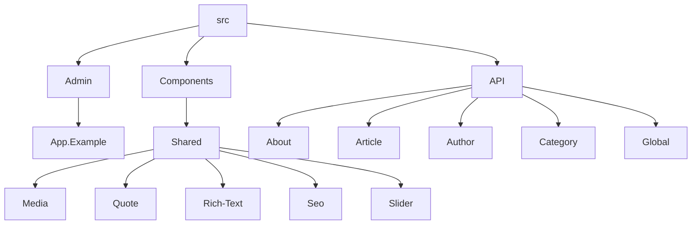

Mermaid Diagrams
#
API Flowchart

```mermaid
flowchart TD
  A[src] --> D[Components]
  A --> B[Admin]
  B --> E[App.Example]
  D --> K[Shared]
  K --> L[Media]
  K --> M[Quote]
  K --> N[Rich-Text]
  K --> O[Seo]
  K --> P[Slider]
  A --> C[API]
  C --> F[About]
  C --> G[Article]
  C --> H[Author]
  C --> I[Category]
  C --> J[Global]
```